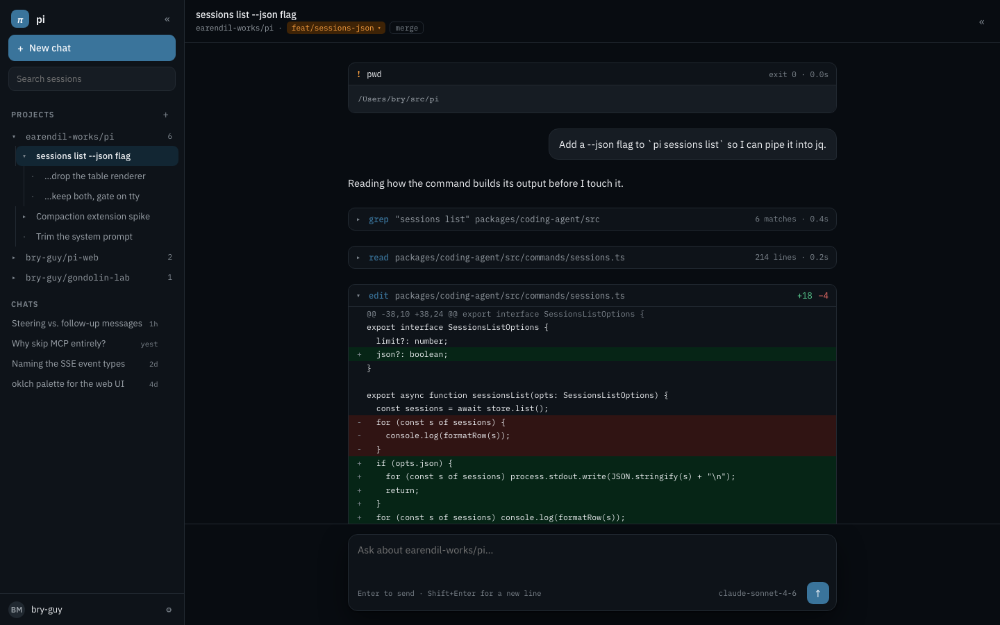
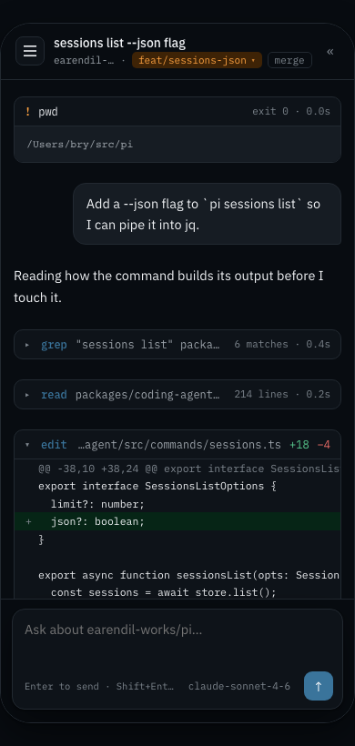

# pi-ez-web

A self-hostable web UI for [Pi](https://github.com/earendil-works/pi) coding-agent sessions: chat with Pi in the browser, attach projects, and work in branch-backed sessions.

## Example

The current design prototype shows a project session inspecting a repository, running a command, and applying a diff.

**Desktop**



**Mobile**



These previews come from [design revision 2](design/revision-2/design/pi-app-standalone.html).

## Use

Run the mock UI without Pi credentials — **`npm run dev` is a scripted mock**: replies are canned (prefixed `mock:`), the model picker shows `Mock Fast` / `Mock Smart`, and nothing reaches a real agent. It exists to exercise the UI and event contract only:

```sh
npm install
npm run dev
# open http://localhost:3141
```

Run against the real Pi agent:

```sh
npm install @earendil-works/pi-coding-agent
npm run verify:real   # explicit, credentialed SDK + model smoke test
npm start
```

Chats and project sessions can be created before a provider is configured. The
first prompt asks you to connect a model provider when no usable model is
available. Settings provides Anthropic OAuth/API-key login, OpenAI ChatGPT/Codex
OAuth, OpenAI API-key login, and the default-model selector. Branch switching,
the file tree, and forking appear only inside a **project** session — connect a
repo first (the `+` next to PROJECTS, or the Projects screen). Plain chats
intentionally have none of those affordances.

## Install and configure

Requires Node.js 20 or newer. Configure Pi once so `~/.pi/agent` contains its auth and model settings. Add projects in `~/.pi-web-ui/config.json`:

```json
{
  "projects": [
    { "id": "my-project", "name": "my-project", "repoPath": "/path/to/my-project" }
  ],
  "reposRoot": "~/src",
  "worktreeRoot": null,
  "defaultModel": null,
  "repositorySources": {
    "default": "local",
    "github": { "owner": "bry-guy" }
  }
}
```

`defaultModel: null` means Automatic: use the first currently available
provider model. An explicit value must be a usable `provider/modelId` reference.
Use `PORT` to change the HTTP port and `PI_WEB_HOME` to change application
state. `PI_WEB_REPOS_ROOT` overrides the repository scan and clone root (for
example, `PI_WEB_REPOS_ROOT=/Users/bryan/dev mise start`). The project picker
supports Local, GitHub, and public HTTPS Git URL sources. With a configured
owner, public GitHub repositories can be browsed before login; GitHub device
login adds private repositories and stores its token in
`PI_WEB_HOME/github-auth.json`; Pi AI credentials remain in
`PI_CODING_AGENT_DIR/auth.json`. Never put either credential in `config.json`.

Other environment overrides are `PI_WEB_REPOSITORY_SOURCE`,
`PI_WEB_GITHUB_CLIENT_ID` (advanced server OAuth-app override),
`PI_WEB_GITHUB_OWNER`, and `PI_WEB_GITHUB_TOKEN`. The client ID is not a normal
user setting: until the project ships its own registered OAuth App ID, a
deployment must provide that public ID through this advanced override.
Environment values take precedence over config and are read-only in Settings.
The default local repository root is `$HOME/src`. The
picker also accepts an absolute or `~/...` repository path directly. Omit
`worktreeRoot` to use the Pi-adjacent default `~/.pi/worktrees`, or set it to an
absolute path. Project entries may set `mode` to `manual` (default) or `auto`;
change that in `config.json` for now. Auto-mode branch names: colliding
sessions with the same opening message get `-2`, `-3`…; fork children get `.1`,
`.2`. Pi-web's config, bindings, chats, and UI state remain under
`~/.pi-web-ui`; existing worktrees are discovered in place and are not moved.
Plain chats use private scratch workspaces under
`~/.pi-web-ui/chats/<scratch-id>` and scratch directories are retained for
manual cleanup. The model picker is backed by Pi's available model runtime.

## Trust boundary

v1 has no authentication and no sandbox: the agent can run shell commands as the service user. Bind it only inside a trusted LAN or tailnet/VPN. Never port-forward it or expose it directly to the public internet.

## Mise tasks

[`mise.toml`](mise.toml) requires Node 22 and wraps the common local commands:

```sh
mise install       # install the declared Node version
mise bootstrap     # install npm dependencies
mise dev           # mock server; isolated state under .mise/state/mock
mise test          # run server, SDK, and DOM tests
mise test:dom      # run the DOM-only gate
mise check         # tests plus whitespace validation
mise start         # real server
mise kill          # stop listeners on PORT (default 3141)
mise verify-real   # credentialed real-Pi smoke test
mise reset         # clear mock state
```

With the mock server running, `mise dev-project` registers the current checkout as a project. `mise preview-design` opens the latest standalone prototype on macOS. Set `PI_WEB_HOME` or `PORT` to override the defaults. `mise kill` also accepts a port directly (`mise kill -- 3141`).

See [deployment.md](docs/deployment.md), [implementation.md](docs/implementation.md), [archived PLAN.md](docs/archive/PLAN.md), [archived remediation plan](docs/archive/pi-web-ui-remediation.md), and [design/](design/) for the implementation and design references. Use the archived [CHECKLIST.md](docs/archive/CHECKLIST.md) for the browser click-through gate.
